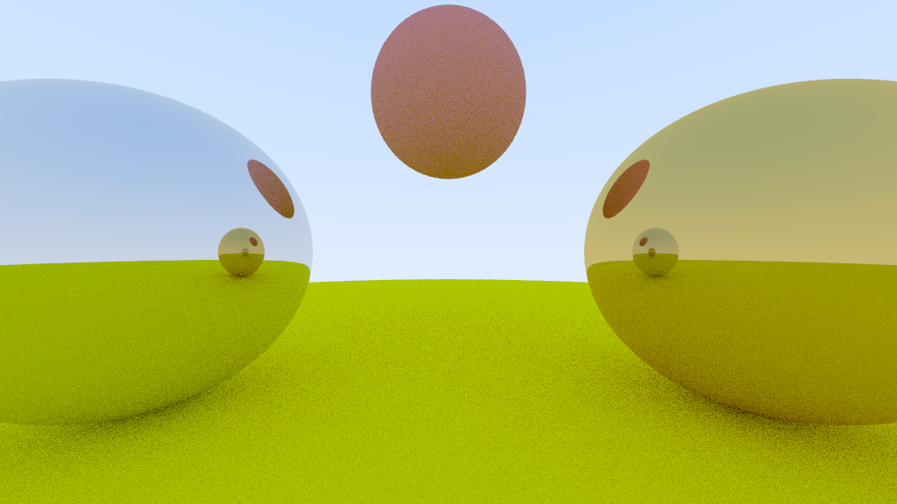

# Path Tracer implementation in Rust

This repository contains a path tracer implementation in Rust. The program is capable of rendering images of 3D scenes with spheres and planes.



## Description

Path tracing is a computer graphics method of rendering images of three-dimensional scenes such that the global illumination is faithful to reality. It is a physically based rendering algorithm that simulates light transport, which naturally simulates many effects that have to be specifically added to other algorithms. These effects include soft shadows, depth of field, motion blur, caustics, ambient occlusion, and indirect lighting. Path tracing is a Monte Carlo method: it repeatedly traces paths of light through the scene and uses the results to estimate the final image.

## Compiling

To compile the program, run the following command in the root directory of the project:

```bash
cargo build
```


If you want to compile the program without debbuging information, run the following command in the root directory of the project:

```bash
cargo build --release
```

Both methods will create a binary in the `target/release` directory. The binary will be named `path_tracer`.

## Building documentation

To build the documentation, run the following command in the root directory of the project:

```bash
cargo doc
```

The documentation will be created in the `target/doc` directory. To view the documentation, open the `index.html` file in the `target/doc` directory in a web browser or run the following command in the root directory of the project:

```bash
cargo doc --open
```

## Running

To run the program, run the following command in the root directory of the project:

```bash
cargo run
```

To run the program without debbuging information, run the following command in the root directory of the project:

```bash
cargo run --release
```

The program will create a `output.ppm` file in the root directory of the project. The file will contain the rendered image.